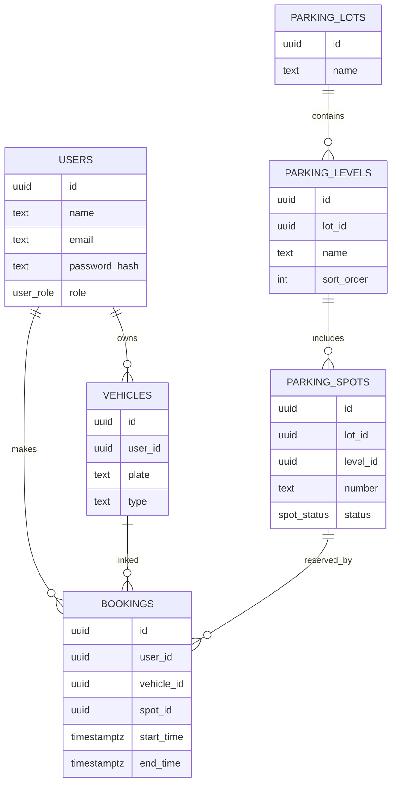

#  Vehicles Parking Management System — Database Schema

A robust **PostgreSQL schema** for managing parking operations, users, vehicles, and bookings.
Built for scalability and clean data relationships. The database is hosted and managed using **Supabase** for reliable cloud-based PostgreSQL infrastructure.

---

## 🧩 Key Features

*  **Secure authentication** with `pgcrypto`
*  **Role-based access control** (`user`, `admin`)
*  **Multi-vehicle support** per user
*  **Hierarchical parking management** — Lot → Level → Spot
*  **Smart booking system** — ensures one active booking per spot/vehicle
*  **Cascade deletes** to maintain data consistency
*  **Supabase integration** — fully cloud-managed PostgreSQL setup

---

##  Database Structure



---

## ⚙️ Setup Instructions

1. Create the extension:

   ```sql
   CREATE EXTENSION IF NOT EXISTS pgcrypto;
   ```

2. Run the schema:

   ```bash
   psql -U <username> -d <database> -f schema.sql
   ```

   Or if using **Supabase**, you can execute the script directly from the SQL editor in your project dashboard.

3. Verify enums:

   ```sql
   SELECT unnest(enum_range(NULL::user_role));
   SELECT unnest(enum_range(NULL::spot_status));
   ```

---

##  Enum Types

| Enum          | Values                                    |
| ------------- | ----------------------------------------- |
| `user_role`   | `'user'`, `'admin'`                       |
| `spot_status` | `'AVAILABLE'`, `'OCCUPIED'`, `'DISABLED'` |
